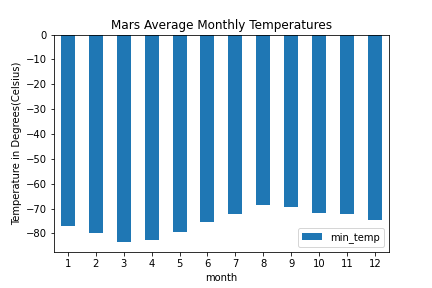
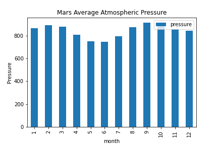

# Mission-to-Mars

## Overview
### Purpose
In this Analysis, we will help Robin scrape, organize, analyze, and visualize the data. We will identify HTML elements on a page, identify their id and class attributes, and use this knowledge to extract information via both automated browsing with Splinter and HTML parsing with Beautiful Soup
## Results :
### Deliverable 1 :  Scrape titles and preview text from Mars news articles. Optionally export the data into a JSON file or a MongoDB database.

[mars_data_challenge_part_1 ipynb File](mars_data_challenge_part_1.ipynb)

#### Code 
        mars_news = []
        for m in news_p:
        title = m.find("div", class_="content_title").text
        preview = m.find("div", class_="article_teaser_body").text
   
        mars_dict = {}
        mars_dict["title"] = title
        mars_dict["preview"] = preview
   
        mars_news.append(mars_dict)
        mars_dict

        
### Deliverable 2 : Scrape and analyze Mars weather data, which exists in a table.

[mars_data_challenge_part_2 ipynb File](mars_data_challenge_part_2.ipynb)

Scrape and analyze Mars weather data, which exists in a table.

        mars_df = pd.read_html("https://data-class-mars-challenge.s3.amazonaws.com/Mars/index.html")
        mars_df
        
        # How many months exist on Mars?
        mars_months = df['month'].nunique()
        print(mars_months, f'months')
        
        # How many Martian (and not Earth) days worth of data exist in the scraped dataset?
         martian_Days = df['sol'].nunique()
         martian_Days

         # the coldest and the warmest months
           min_temp_avg = month_temp_df.min()
           min_temp_avg

         # warmest month 
           max_temp_avg = month_temp_df.max()
           max_temp_avg

         

         # Which month have the lowest  atmospheric pressure on Mars?
           min_avg_pressure= month_pressure_df['pressure'].min()
           lowest_pressure_month=month_pressure_df.loc[month_pressure_df['pressure']==min_avg_pressure]
           lowest_pressure_month

           max_avg_pressure= month_pressure_df['pressure'].max()
           highest_pressure_month=month_pressure_df.loc[month_pressure_df['pressure']==max_avg_pressure]
           highest_pressure_month

                

### CSV File

[Mars_weather CSV File](Mars_weather)

       # Save DataFrame to a CSV file
          df.to_csv('Mars_df')
